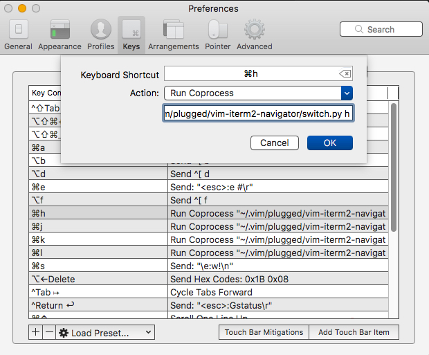

THIS IS A FORK OF https://github.com/zephod/vim-iterm2-navigator
## FYI 
1. It worked for vim&nvim in the lastest iterm2(Build 3.3.0beta7.
2. It only worked for vim-plug management.Because some hard coding path in 'vim-iterm2-navigator/plugin/iterm2_navigator.vim' source file. Change the below path, If other plugin management is your first choice. and it should work.
```
let cmd = 'osascript ~/.vim/plugged/vim-iterm2-navigator/applescript/iterm2_l.scpt'

```

3. DON NOT  MAP ctrl-h/j/k/l , these keys colide with shell hotkey in iterm2. MAP CMD-h/j/k/l may be a good idea.


## Vim+iterm2 Seamless Navigation Plugin

Use Cmd+j, Cmd+k, Cmd+l, Cmd+h to seamlessly navigate between your split Vim panes and split iTerm2 panes while editing.

Based on the similar but different [vim-tmux-navigator](https://github.com/christoomey/vim-tmux-navigator) plugin. I wanted to do the same for my native split panes in iTerm, which means using AppleScript...

This plugin is for developers using cli-mode Vim (not MacVim) inside an iTerm2 window, dealing with lots of split panes.

#### To Install:

Add this repo to your .vimrc.
```
Plug 'zk4/vim-iterm2-navigator'
```

Now configure iTerm2's keyboard shortcuts. **Cmd-J** should be set to **run coprocess**. This coprocess is `~/.vim/plugged/vim-iterm2-navigator/switch.py j`. Note the argument passed to the script.  Screenshot of settings:



---

